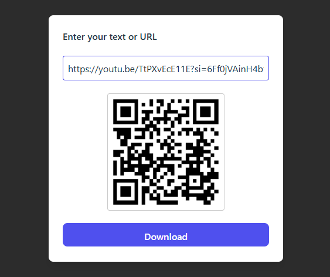

# QR Code Generator

A simple React application that allows users to generate QR codes from text or URLs and download them as PNG files.

## 🚀 Features

- Generate a QR code instantly from any input text or URL
- Live preview of the QR code
- Download QR code as an image (`.png`)
- Auto-generated filename based on input (if less than 20 characters)
- Clean UI built with Tailwind CSS

---

## 🛠️ Technologies Used

- **React.js**
- **Tailwind CSS**
- **QRServer API** for generating QR images

---

## 📌 Usage

1. Type any text or URL in the input field.
2. A QR code will be generated automatically.
3. Click **Download** to save the QR as an image.

---

## 📸 Screenshot



---

## ⚙️ API Used

The app uses the free **QRServer** API:

```
https://api.qrserver.com/v1/create-qr-code/?size=150x150&data=YOUR_TEXT
```

---

## 📄 License

MIT License — free to use and modify.

---

## 💡 Notes

- The download button is disabled until the user enters text.
- The container expands when input is present for smoother UI.

---

## ✨ Author

Developed by **Hyanx**
